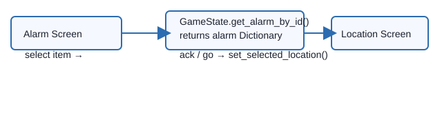
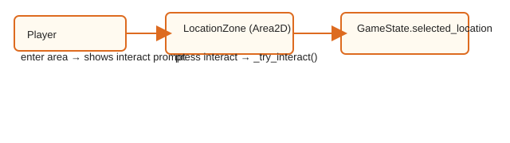
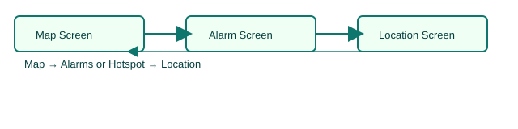
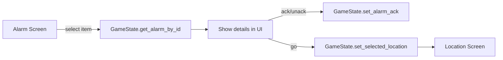
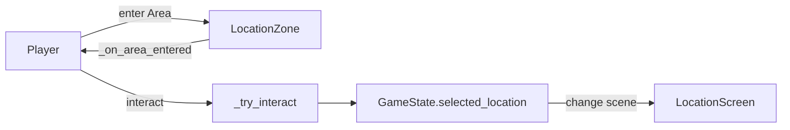
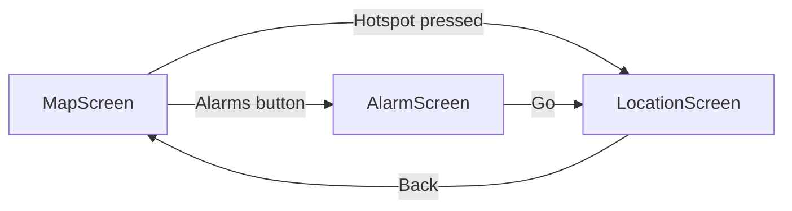

# Code Details

This document expands on `docs/code_overview.md` with code excerpts, parameter and return details, and a few simple diagrams to help you learn how the systems interact.

Files covered (quick links):
- `game/scripts/autoload/gamestate.gd`
- `game/scripts/player/player_controller.gd`
- `game/scripts/screens/map_screen.gd`
- `game/scripts/screens/location_screen.gd`
- `game/scripts/screens/alarm_screen.gd`
- `game/scripts/world/world_main.gd`
- `game/scripts/world/location_zone.gd`
- `game/scripts/ui/location_hotspot.gd`
- `game/scripts/world/debug_floor.gd`
- `game/scripts/resources/location_data.gd`

---

**Autoload / Global State** — `game/scripts/autoload/gamestate.gd`

Purpose: central store for `LOCATIONS`, `LOCATION_ID_BY_KEY`, and the `alarms` array. Accessible at runtime as the autoload singleton `GameState`.

Key excerpts & function details:

- alarms (Array[Dictionary]) — each alarm dictionary contains:
  - `id`, `title`, `severity`, `location_id`, `symptom`, `hint`, `ack`, `active`

- get_alarm_by_id(alarm_id: String) -> Dictionary
  - Behavior: linear search of `alarms`; returns the alarm dictionary or an empty Dictionary `{}`.
  - Excerpt:

```gdscript
func get_alarm_by_id(alarm_id: String) -> Dictionary:
    for a in alarms:
        if str(a.get("id", "")) == alarm_id:
            return a
    return {}
```

- set_alarm_ack(alarm_id: String, ack: bool) -> void
  - Behavior: searches `alarms` by index and sets the `ack` boolean. Returns early after updating.
  - Notes: mutates the alarms array in place; UI code calls this to toggle acknowledgement.

- get_active_alarm_count() / get_active_alarm_count_by_location(location_id: String)
  - Behavior: iterate alarms, count where `active` is truthy (and optionally where `location_id` matches). Simple O(n) operations.

- severity_label(sev: int) -> String
  - Maps numeric severity to text. Uses `match`:
  ```gdscript
  match sev:
    3: return "HIGH"
    2: return "MED"
    _: return "LOW"
  ```

- location_id_from_key(key: int) -> String
  - Uses `LOCATION_ID_BY_KEY[key]` with bounds checking; returns `""` if out of range.

- location_key_from_id(id: String) -> int
  - `return LOCATION_ID_BY_KEY.find(id)` — returns `-1` if not found.

Design notes:
- The autoload is intentionally simple and data-oriented. Consider moving alarm lifecycle logic (activate/deactivate) into explicit functions if alarm state gets more complex.

---

Line-by-line annotated walkthrough — `game/scripts/autoload/gamestate.gd`

Below is a guided walkthrough of key parts of `gamestate.gd`. Each snippet is followed by what it does and why it matters.

- Constants / enum mapping

```gdscript
const LOCATION_EQUIPMENT_FLOOR := "EQUIPMENT_FLOOR"
const LOCATION_PLC_ROOM := "PLC_ROOM"
const LOCATION_DRIVE_ROOM := "DRIVE_ROOM"
const LOCATION_OPERATOR_PULPIT := "OPERATOR_PULPIT"

enum LocationKey {
  EQUIPMENT_FLOOR,
  PLC_ROOM,
  DRIVE_ROOM,
  OPERATOR_PULPIT,
}

const LOCATION_ID_BY_KEY := [
  LOCATION_EQUIPMENT_FLOOR,
  LOCATION_PLC_ROOM,
  LOCATION_DRIVE_ROOM,
  LOCATION_OPERATOR_PULPIT,
]
```

Explanation: constants provide canonical string IDs used across scenes/resources. `LocationKey` is an editor-facing numeric enum; `LOCATION_ID_BY_KEY` maps those numeric indices to the string IDs so the editor can store a compact value while runtime logic uses stable strings.

- Function: `location_id_from_key`

```gdscript
func location_id_from_key(key: int) -> String:
  if key >= 0 and key < LOCATION_ID_BY_KEY.size():
    return LOCATION_ID_BY_KEY[key]
  return ""
```

Explanation: safe lookup with bounds check; returns empty string on invalid index. Useful both at editor-time (tool scripts) and runtime to prevent crashes.

- Function: `get_alarm_by_id`

```gdscript
func get_alarm_by_id(alarm_id: String) -> Dictionary:
  for a in alarms:
    if str(a.get("id", "")) == alarm_id:
      return a
  return {}
```

Explanation: simple linear search. Pros: straightforward and easy to reason about. Cons: O(n) per lookup — if you expect many alarms or frequent lookups, consider indexing by a Dictionary keyed by `id` for O(1) access.

- Function: `set_alarm_ack`

```gdscript
func set_alarm_ack(alarm_id: String, ack: bool) -> void:
  for i in range(alarms.size()):
    if str(alarms[i].get("id", "")) == alarm_id:
      alarms[i]["ack"] = ack
      return
```

Explanation: searches by index to mutate in-place and returns early after updating. This avoids copying the alarm list. If adding persistence later, this is the place to hook save logic.

- Function: `get_active_alarm_count` / `get_active_alarm_count_by_location`

```gdscript
func get_active_alarm_count() -> int:
  var n := 0
  for a in alarms:
    if bool(a.get("active", false)):
      n += 1
  return n

func get_active_alarm_count_by_location(location_id: String) -> int:
  var n := 0
  for a in alarms:
    if bool(a.get("active", false)) and str(a.get("location_id", "")) == location_id:
      n += 1
  return n
```

Explanation: small utility counters used by UI. If you find yourself calling these frequently each frame, cache or maintain counters when alarms change.

- Function: `set_selected_location`

```gdscript
func set_selected_location(location_id: String) -> void:
  if LOCATIONS.has(location_id):
    selected_location = location_id
  else:
    push_warning("Invalid location_id passed to set_selected_location: %s" % location_id)
```

Explanation: validates before assigning. `push_warning` helps catch editor-time or runtime misconfigurations without throwing an error.

---

**Player Controller** — `game/scripts/player/player_controller.gd`

Purpose: character movement and interaction handling (WASD + click-to-move + interact prompt).

Important members & types:
- `move_speed: float` — movement speed used by `move_and_slide()`.
- `navigation_agent_2d` — NavigationAgent2D node used for click-to-move pathing.
- `interaction_area: Area2D` — area that detects `LocationZone` overlaps.
- `current_zone: LocationZone` — last entered `LocationZone` (used by `_try_interact`).

Key functions:

- _ready()
  - Connects `interaction_area.area_entered` and `area_exited` to handlers.

- _on_area_entered(area: Area2D) / _on_area_exited(area: Area2D)
  - If the area is a `LocationZone` store/clear `current_zone` and show/hide prompt.

- set_move_target(target_global_pos: Vector2)
  - Enables click target by setting `navigation_agent_2d.target_position` and flipping `has_click_target`.

- clear_move_target()
  - Clears click-target; sets agent target to current position so movement stops.

- _try_interact()
  - Guard: returns if `current_zone` null or invalid.
  - Behavior: resolves `loc_id := current_zone.get_location_id()` and sets `GameState.selected_location = loc_id`.
  - Optional: can call `get_tree().change_scene_to_file(...)` to open `location_screen`.

- _physics_process(_delta)
  - Handles three modes, in priority order:
    1. WASD input -> immediate velocity, clears click target
    2. Interact button -> call `_try_interact()`
    3. If `has_click_target`, follow `navigation_agent_2d` path -> compute next waypoint and set velocity toward it

Excerpt (movement decision):

```gdscript
if input_dir.length_squared() > 0.0:
    clear_move_target()
    velocity = input_dir.normalized() * move_speed
    move_and_slide()
    return

if has_click_target and not navigation_agent_2d.is_navigation_finished():
    var next_pos := navigation_agent_2d.get_next_path_position()
    var to_next := next_pos - global_position
    if to_next.length() > 1.0:
        velocity = to_next.normalized() * move_speed
    else:
        velocity = Vector2.ZERO
    move_and_slide()
```

Notes:
- The controller references `get_tree().current_scene.get_node("ui_layer/interact_prompt")` during `@onready`. This assumes your scene hierarchy exists at load; if you spawn the player before UI is added this may be null.

Line-by-line annotated walkthrough — `game/scripts/player/player_controller.gd`

Key exported / onready variables:

```gdscript
@export var move_speed: float = 250.0
@onready var navigation_agent_2d: NavigationAgent2D = $navigation_agent_2d
@onready var interact_prompt: Label = get_tree().current_scene.get_node("ui_layer/interact_prompt")
@onready var interaction_area: Area2D = $interaction_area

var has_click_target: bool = false
var current_zone: LocationZone = null
```

Explanation: `@onready` gets node references when scene tree is ready. The `interact_prompt` lookup assumes the UI layer exists in `current_scene` — consider null-checking if scenes are loaded in a different order.

- `_ready()`

```gdscript
func _ready() -> void:
  interaction_area.area_entered.connect(_on_area_entered)
  interaction_area.area_exited.connect(_on_area_exited)
  _set_prompt_visible(false)
```

Explanation: connects Area2D signals to local handlers; hides the prompt initially.

- `_on_area_entered` / `_on_area_exited`

```gdscript
func _on_area_entered(area: Area2D) -> void:
  if area is LocationZone:
    current_zone = area
    _set_prompt_visible(true)

func _on_area_exited(area: Area2D) -> void:
  if area == current_zone:
    current_zone = null
    _set_prompt_visible(false)
```

Explanation: sets `current_zone` only when entering a `LocationZone`. Exiting clears it (only if exiting the same zone) to avoid clearing due to unrelated areas.

- `_try_interact()`

```gdscript
func _try_interact() -> void:
  if current_zone == null or not current_zone.is_valid():
    return

  var loc_id : String = current_zone.get_location_id()
  GameState.selected_location = loc_id
  print("interact location_id:", loc_id)
  # optional: change scene to location screen
```

Explanation: defensive guard ensures interactions only occur with valid zones, then sets the global selected location for UI to consume.

- `_physics_process(_delta)` — prioritized input handling

```gdscript
var input_dir := Vector2(
  Input.get_action_strength("move_right") - Input.get_action_strength("move_left"),
  Input.get_action_strength("move_down") - Input.get_action_strength("move_up")
)

# 1) WASD movement overrides click-to-move
if input_dir.length_squared() > 0.0:
  clear_move_target()
  input_dir = input_dir.normalized()
  velocity = input_dir * move_speed
  move_and_slide()
  return

# 2) Interaction key handling
if Input.is_action_just_pressed("interact"):
  _try_interact()

# 3) Click-to-move following the navigation path
if has_click_target and not navigation_agent_2d.is_navigation_finished():
  var next_pos := navigation_agent_2d.get_next_path_position()
  var to_next := next_pos - global_position
  if to_next.length() > 1.0:
    velocity = to_next.normalized() * move_speed
  else:
    velocity = Vector2.ZERO
  move_and_slide()
else:
  velocity = Vector2.ZERO
```

Explanation: order matters. WASD should immediately give player direct control. The navigation agent provides smooth click-to-move behavior; the code uses a small threshold (1.0) to avoid jitter when near a waypoint.

---

Embedded diagrams (rendered SVG assets):

- Alarm flow: `docs/assets/alarm_flow.svg`
  

- Player interaction: `docs/assets/player_interaction.svg`
  

- Screen navigation: `docs/assets/screen_navigation.svg`
  


---

**Map Screen** — `game/scripts/screens/map_screen.gd`

Purpose: present map, bind hotspot buttons to `_go_to_location`, and show Alarm count.

Important behaviors:
- On `_ready()` it iterates `get_tree().get_nodes_in_group("location_hotspot")`, validates hotspots, binds `pressed` to a callable that calls `_go_to_location(location_id)`.
- Keeps `_bindings` to disconnect them on `_exit_tree()` to avoid duplicate signal connections when scenes reload.

Excerpt (binding creation):

```gdscript
for n in get_tree().get_nodes_in_group("location_hotspot"):
    var b := n as LocationHotspot
    if b == null: continue
    var c := Callable(self, "_go_to_location").bind(b.get_location_id())
    b.pressed.connect(c)
    _bindings.append({"button": b, "callable": c})
```

---

**Location Screen** — `game/scripts/screens/location_screen.gd`

Purpose: display `GameState.selected_location` metadata.

Notes & excerpt:
- Uses `GameState.LOCATIONS.get(GameState.selected_location, default_info)` to tolerate missing entries.
- Copies `title` and a `desc` (supports either `desc` or `description` keys).

---

**Alarm Screen** — `game/scripts/screens/alarm_screen.gd`

Purpose: list active alarms, show detail for selected alarm, ack/unack, and jump to its location.

Key logic:
- `_refresh_list()` iterates `GameState.alarms` and only includes those with `active == true`. It computes `sev_text` via `GameState.severity_label(sev)` and `loc_title` from `GameState.get_location_info(loc_id).get("title")`.
- Item metadata stores the alarm `id` so selection handlers can fetch the alarm by id.

Excerpt (list population):

```gdscript
for a in GameState.alarms:
    if not bool(a.get("active", false)): continue
    var sev := int(a.get("severity", 1))
    var line := "[%s] %s  •  %s" % [GameState.severity_label(sev), str(a.get("title", "Alarm")), loc_title]
    alarm_list.add_item(line)
    alarm_list.set_item_metadata(alarm_list.item_count - 1, str(a.get("id", "")))
```

Action handlers:
- `_on_ack_pressed()` toggles ack and refreshes selected display.
- `_on_go_pressed()` uses `GameState.set_selected_location(loc_id)` then changes to `location_screen`.

---

**World Main** — `game/scripts/world/world_main.gd`

Purpose: places the player at the spawn on `_ready()` and forwards clicks to the player for click-to-move.

Key excerpt:

```gdscript
func _unhandled_input(event: InputEvent) -> void:
    if event is InputEventMouseButton and event.button_index == MOUSE_BUTTON_LEFT and event.pressed:
        var target := get_global_mouse_position()
        player.set_move_target(target)
```

---

**LocationZone** & **LocationHotspot** (similar) — `location_zone.gd`, `location_hotspot.gd`

Purpose: exported `location_key` (enum) maps to string ids using `GameState.location_id_from_key()`.

Key functions:

- get_location_id() -> String
  - `return GameState.location_id_from_key(int(location_key))`

- is_valid() -> bool
  - Ensures the mapped id is non-empty and present in `GameState`.

Editor-time warnings: `_ready()` is `@tool` and pushes warnings in the editor for empty/invalid mappings.

---

**Debug Floor** — `game/scripts/world/debug_floor.gd`

Purpose: draws a grid for level editing; `grid_size` and `half_extent` control line spacing. Useful for checking layout & snapping.

---

**Resources**

- `LocationData` — simple `Resource` with `id`, `title`, `desc`.
- `LocationCollection` — `items: Array` (keeps collection simple and decoupled from `LocationData` type references in the editor).

---

Diagrams (Mermaid)

1) Alarm flow (how UI -> GameState -> Location selection works):



2) Player interaction flow (enter zone -> interact -> open location):



3) Screen navigation (Map, Alarms, Location):



Notes on diagrams:
- Mermaid blocks are plain text in this file; many Markdown viewers (and VS Code with extensions) can render them. If you want PNG/SVG exports, I can produce them separately.

---

How I structured these docs:
- Each function section includes the purpose, inputs/outputs, and a short code excerpt showing the core logic.
- Editor/runtime differences and common pitfalls are flagged where appropriate.

Next steps I can take for you:
- Add rendered SVG diagrams into `docs/assets/` and embed them in this file.
- Expand the snippets into full annotated walkthroughs per function.
- Generate a printable PDF of the docs.

If you want a narrower focus (for example: expand only `gamestate.gd` with unit-test style examples), tell me which file to prioritize and I will iterate.
